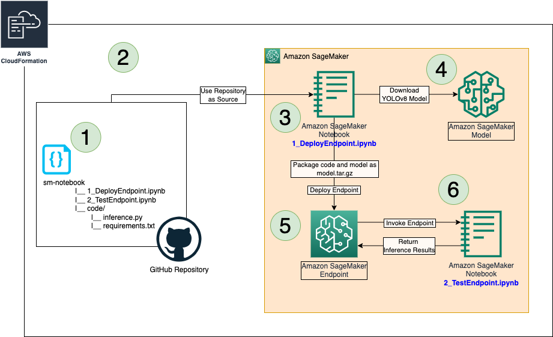
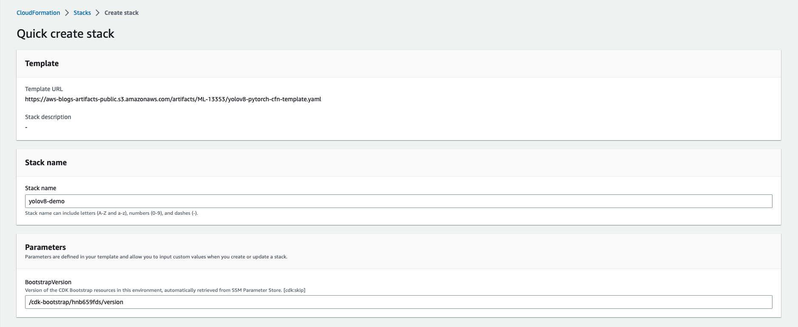
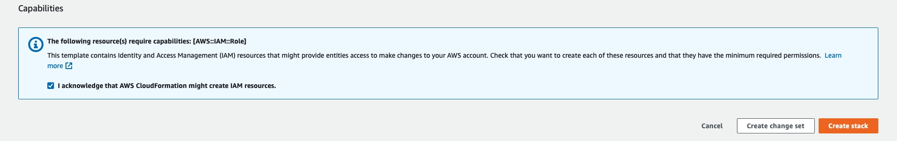
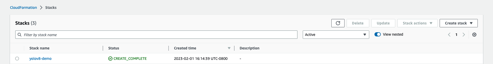

# Host a YOLOv8 model on a SageMaker Endpoint
This aim of this project is to host a [YOLOv8](https://github.com/ultralytics/ultralytics)* PyTorch model on a [SageMaker Endpoint](https://aws.amazon.com/sagemaker/) and test it by invoking the endpoint. The project utilizes [AWS CloudFormation/CDK](https://aws.amazon.com/cloudformation/) to build the stack and once that is created, it uses the SageMaker notebooks created in order to create the endpoint and test it.

## AWS Architecture:

## AWS CloudFormation Stack Creation
The AWS CloudFormation Stack can be created using 2 methods: (1) Using Template or (2) Using AWS CDK. Both the methods are described as follows:

1. Create Stack using AWS CloudFormation:
    - Choose **Launch Stack** and (if prompted) log into your AWS account:
    
    - Select a unique Stack Name, ackowledge creation of IAM resources, create the stack and wait for a few minutes for it to be successfully deployed
        1. 
        2. 
        3. 

